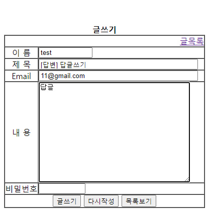

# jstl 초기세팅용 자바 프로젝트
------
### 설명
자바학원 처음다녀서 자바 차음배웠을때 만든 게시판.

### 이력
1. backup : 2017-05-16
2. modify : 2017-05-17 : ver1.0.1 : web.xml -->  add: encoding (UTF-8)
3. modify : 2020-03-04 :ver1.0.1 : 오라클 쿼리 -> MyriaDB 쿼리로 수정

### 주요 기능
1. 로그인(회원가입, 로그아웃)
2. 게시판(글리스트, 글쓰기, 글수정, 글삭제, 댓글달기)

### 관련사진

